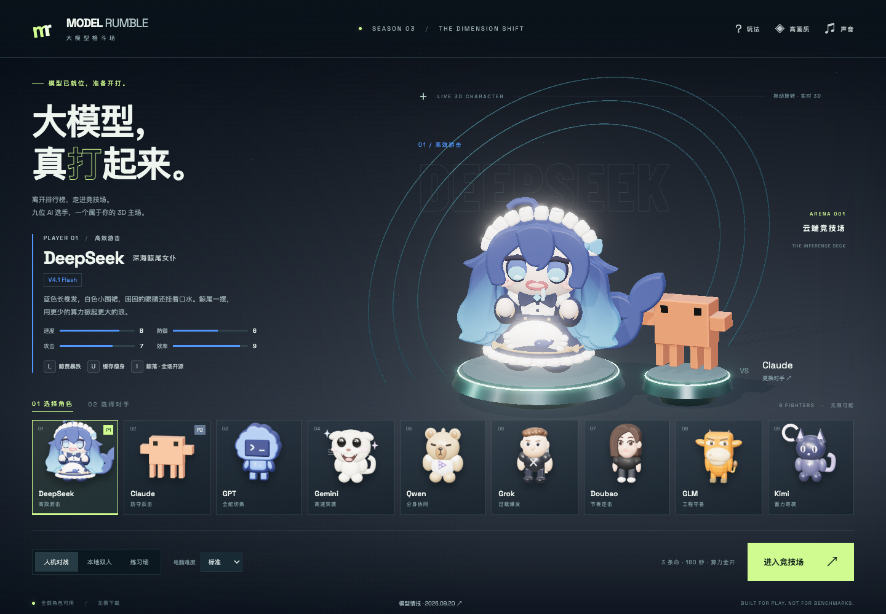
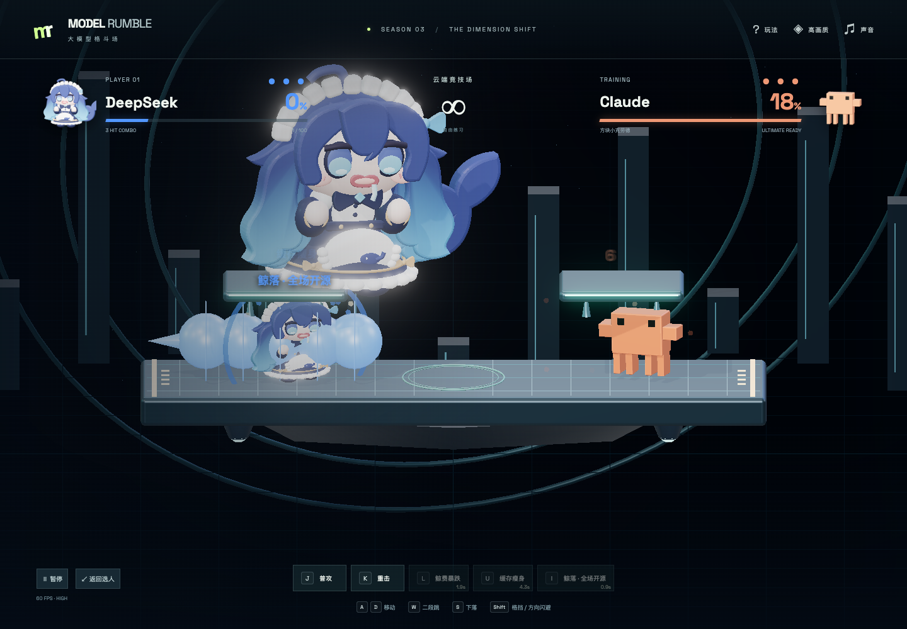
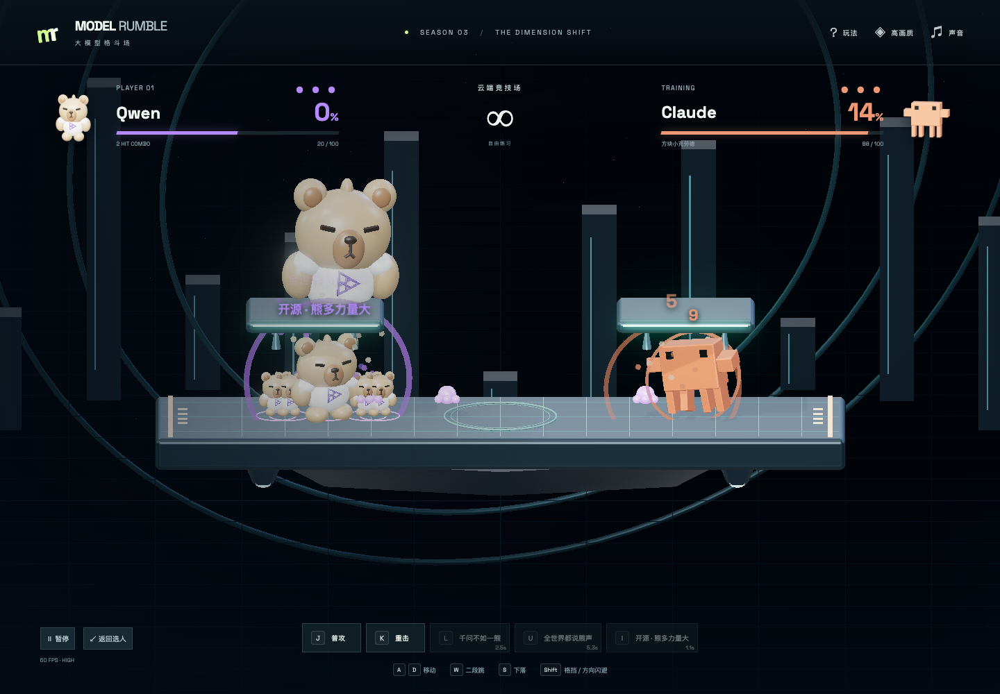
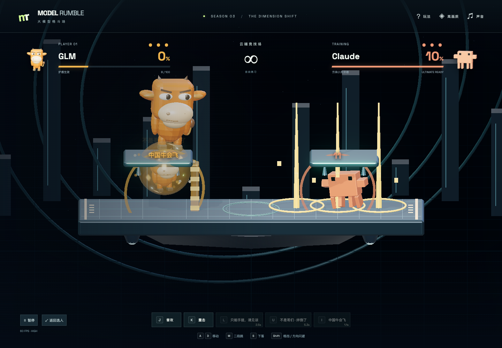
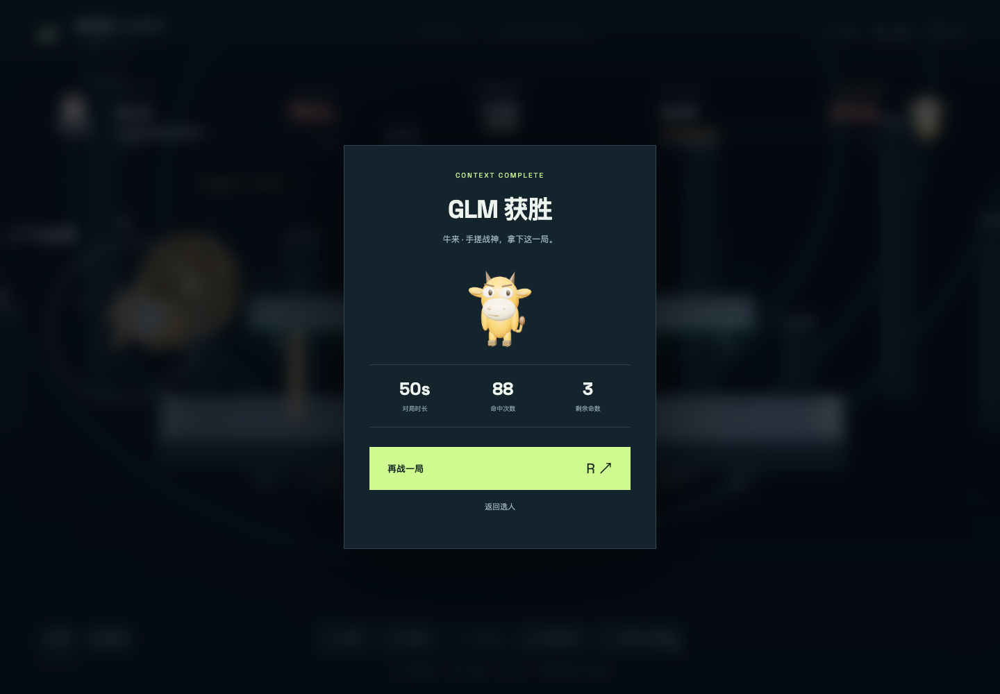

<div align="center">

# Model Rumble 3D · 大模型格斗场

**九个大模型品牌梗角色，在浏览器里的实时 3D 横版平台格斗。**

*A browser-based 3D platform fighter starring nine fan-made LLM mascots.*




</div>

“离开排行榜，走进竞技场。”Model Rumble 把 DeepSeek、Claude、GPT、Gemini、Qwen、Grok、Doubao、GLM、Kimi 做成九个粉丝向 3D 公仔，每个角色的招式都取材于对应模型的公开能力和社区梗。玩法借鉴平台格斗：把对手的“幻觉率”打高，再把他打出场外。

游戏是纯前端项目，运行时不需要后端、API key 或任何外部模型服务。

| 大招：鲸落·全场开源 | 大招：开源·熊多力量大 |
| :---: | :---: |
|  |  |
| **大招：中国牛会飞** | **结算画面** |
|  |  |

## 特性

- **真 3D 角色**：九个角色都由 Three.js 网格程序化建模（圆角体、挤出、曲线、分组关节），不加载外部模型文件，也不用 2D 精灵冒充。选人页可以拖动预览旋转，缩略图直接从实时模型渲染得到。
- **完整画面管线**：正交镜头锁定横向战斗平面，配合 PBR 材质、`RoomEnvironment` 环境反射、软阴影和 Unreal Bloom。右上角可切到“流畅”画质，关闭阴影和后处理。
- **27 个专属技能**：每个角色有专属技、辅助技和大招，包括实体投射物、召唤分身、可被打坏的墙、反击窗口、姿态切换、区域落击等独立机制。
- **四档电脑 AI**：Low / Medium / High / Ultra。难度只调整反应延迟、决策频率、进攻性、防守和预判，不修改角色属性。
- **键盘、本地双人、触屏**：一台电脑两人对打；手机和平板有屏幕按钮，横屏体验更好。
- **本地音效系统**：Web Audio 预加载，多版本轮换，带并发上限、优先级和背景音乐自动让位。
- **可测试**：战斗模拟与渲染完全分离，规则测试直接在 Node 里跑九角色 81 种 CPU 对阵。

## 玩法规则

- **幻觉率 %**：命中会提高对手的幻觉率。幻觉率越高，被击飞得越远（击退力随幻觉率增长）。
- **命数**：每人 3 条命，被打出场外损失一条。复活后有短暂保护。
- **时间**：每局 180 秒。先耗尽命数的一方落败；超时先比剩余命数，再比幻觉率。
- **算力**：开局 25 点，随时间、命中和受击积累。满 100 可释放大招，释放后清零。
- **格挡与闪避**：按住格挡可大幅减少击退；格挡时配合方向键做闪避。
- **回场**：掉出平台后向场内移动，再用二段跳回到台上。按住下可穿过浮台。

游戏失去焦点或切到后台会自动暂停。系统开启“减少动态效果”时，技能特效会跳过。

## 操作

| 动作 | P1 | 本地 P2 | 触屏 |
| --- | --- | --- | --- |
| 左右移动 | `A` / `D` | `←` / `→` | ← / → |
| 跳跃 / 二段跳 | `W` | `↑` | ↑ |
| 快速下落 / 穿过浮台 | `S` | `↓` | — |
| 普攻 / 重击（可按住连击） | `J` / `K` | `,` / `.` | J / K |
| 专属技 / 辅助技 | `L` / `U` | `/` / `M` | L / U |
| 大招（100 算力） | `I` | `N` | I |
| 格挡；配合方向闪避 | `Shift` | `B` | 盾 |
| 暂停 / 继续 | `Esc` | `Esc` | 暂停按钮 |
| 选人页开局 / 结算后再战 | `Enter` / `R` | 同左 | 页面按钮 |

## 九位角色

属性按速度 / 防御 / 攻击 / 效率四项 1–10 分给出（游戏平衡值）。

| 角色 | 造型 | 定位 | 专属技 L | 辅助技 U | 大招 I |
| --- | --- | --- | --- | --- | --- |
| DeepSeek | 深海鲸尾女仆 | 高效游击 | 鲸费暴跌 | 缓存瘦身 | 鲸落·全场开源 |
| Claude | 方块小克劳德 | 防守反击 | 我不能帮助你 | 让我再想想 | 四脚·规则践踏 |
| GPT | 蓝云桌面宠物 | 全能切换 | 工具全家桶 | 这就帮你做 | Astra·六手下班 |
| Gemini | 双子哈基米 | 高速突袭 | 哈！基！米！ | 双子猫猫拳 | 曼波·多模态蹦迪 |
| Qwen | 千问小熊 | 分身协同 | 千问不如一熊 | 全世界都说熊声 | 开源·熊多力量大 |
| Grok | 火星马老板 | 过载爆发 | 星舰试射 | 推文治公司 | 筷子夹·成功回收 |
| Doubao | 国民豆包 | 节奏连击 | 这题包在我身上 | 豆包哄哄你 | Seedance·全网都是你 |
| GLM | 牛来·手搓战神 | 工程守备 | 只能手搓，请见谅 | 不是哥们·绊倒了 | 中国牛会飞 |
| Kimi | 月面小猫 | 蓄力奇袭 | 月薪换算力 | 猫在想，别催 | 月面猫猫·全员打工 |

每个技能的具体效果和对应的官方资料链接见 `game/src/rumble/roster.ts`，游戏内选人页底部的“模型情报”也能看到。资料核验日期为 2026-09-20。两名玩家选同一角色时，P2 自动换成替代配色。

## 游戏模式

| 模式 | 说明 |
| --- | --- |
| 人机对战 | P1 对战电脑，可选 Low / Medium / High / Ultra 四档难度 |
| 本地双人 | 同一键盘两人对战，P2 使用方向键一侧的按键 |
| 练习场 | 对手不主动攻击；算力快速回满；不计时，出界不扣命 |
| AI 观战 | 地址加 `?autop1=1`，P1 也交给电脑，例如 `http://localhost:5188/?autop1=1` |

## 快速开始

需要 Node.js 22.18 或更高版本（`game/package.json` 的 `engines` 要求，规则测试依赖 Node 的 `--experimental-strip-types`），以及支持 WebGL 2 并开启硬件加速的浏览器。

```bash
git clone https://github.com/Helios5018/model-rumble.git
cd model-rumble/game
npm ci
npm run dev -- --host 0.0.0.0 --port 5188 --strictPort
```

打开 http://localhost:5188 。端口只是示例；浏览器测试默认连接 5188，换端口时用 `RUMBLE_URL` 覆盖。

## 构建与测试

在 `game/` 目录下执行：

```bash
npm run build          # tsc 类型检查 + Vite 生产构建，输出到 game/dist
npm run preview -- --port 5190 --strictPort   # 本地预览生产构建
npm test               # 战斗规则测试，包含九角色 81 种 CPU 对阵
npm run test:browser   # Playwright 真实浏览器测试
```

- `npm test` 用 Node 内置 test runner 直接运行 `tests/combat.test.ts`，不需要浏览器。它覆盖浮台穿越、出界扣命、复活保护、超时与同分、格挡、反击、算力门槛、九种专属机制和练习场规则。
- `npm run test:browser` 需要先启动开发服务或 preview。默认访问 `http://localhost:5188`，可用 `RUMBLE_URL` 改地址。macOS 默认使用本机 Google Chrome，其他系统用 `CHROME_PATH` 指定浏览器（见 `game/playwright.config.ts`）。测试覆盖选人、真实按键移动与技能、九角色大招、本地双人、完整 AI 对局、小屏触控、GPU 资源复用和音频播放链路。

## 技术架构

```text
requestAnimationFrame ─┬─ 输入采集（键盘 / 触屏 / AI）
                       ├─ Match.tick(1/60) × N   固定步长模拟，每帧最多补 3 步
                       │     └─ events[]  命中、施法、KO、复活……
                       ├─ World.emit / AudioBus.event   消费事件：特效、音效、飘字
                       └─ World.render(dt)   按真实帧率渲染
```

- **模拟与渲染分离**：`simulation.ts` 里的 `Match` 是纯逻辑类，不依赖 Three.js 和 DOM。主循环按 1/60 秒固定步长推进，单帧耗时上限 50 ms，每帧最多补 3 个逻辑步，渲染则跟随实际帧率。
- **可复现**：模拟使用带种子的 xorshift 随机数，同样的种子和输入得到同样的对局，Node 测试可以批量跑完整 CPU 对阵。
- **事件驱动表现层**：模拟只产出事件队列，渲染层据此播放特效和飘字，音频层据此选择音效，两者都不回写战斗状态。
- **AI 有反应延迟**：电脑读取的是按难度延迟后的对手快照（Low 0.42 秒到 Ultra 0.1 秒），只有自身回场判断使用实时位置。
- **渲染**：`OrthographicCamera` 正交镜头，PCF 软阴影，`EffectComposer` + `UnrealBloomPass` + `OutputPass`。角色材质按颜色共享缓存，同角色对战时 P2 会单独构建一套替代配色模型，避免污染另一名玩家或选人预览。
- **调试快照**：`window.__RUMBLE__.snapshot()` 只读输出画面、对局、音频和渲染统计，供浏览器测试使用，不暴露修改玩法的接口。

## 项目结构

```text
game/
  index.html
  src/main.ts                选人、HUD、输入、弹窗与固定步长主循环
  src/style.css              界面、响应式布局与触控样式
  src/rumble/roster.ts       九角色设定、属性、技能说明与资料链接
  src/rumble/simulation.ts   战斗模拟、碰撞、技能机制与电脑 AI
  src/rumble/difficulty.ts   四档 AI 参数
  src/rumble/models.ts       程序化角色建模与关节动画
  src/rumble/melee.ts        九角色普攻 / 重击的招式与拖尾
  src/rumble/appearance.ts   玩家色与同角色替代配色
  src/rumble/world.ts        镜头、场景、光照、后处理与技能特效
  src/rumble/audio.ts        Web Audio 音效池与背景音乐
  public/assets/audio/       音效与背景音乐
  public/audio-lab.html      音效对比试听页
  tests/                     战斗规则测试与 Playwright 浏览器测试
  legacy/                    旧版 Phaser 2D 源码和图片素材，不参与构建
.github/assets/              README 截图
tools/asset-pipeline/        素材生成脚本
```

## 素材与音效来源

- **角色、场景、特效**：全部在代码里实时建模和绘制，不使用外部 3D 模型或贴图。
- **音效**：用 ElevenLabs `eleven_text_to_sound_v2` 生成，再经过高通 / 低通滤波、起音裁切、电平限制和淡入淡出处理，存为单声道 WAV。游戏当前使用 `game/public/assets/audio/arcade-v3/`，每个文件的提示词、处理参数、时长、电平和散列都记录在同目录的 `manifest.json`。
- **背景音乐**：`bgm_menu.mp3`、`bgm_battle.mp3` 由 MiniMax 音乐生成，生成提示词见 `tools/asset-pipeline/gen_audio.sh`。
- **试听页**：开发服务运行时访问 `/audio-lab.html`，可以对比第一轮升级前后的六类战斗音效。
- **生成工具链**：`tools/asset-pipeline/` 保存了音效、BGM 和早期 2D 图片素材的生成脚本。这些脚本调用作者本机的媒体生成工具和 API 凭据，克隆仓库后不能直接运行，只作为素材来源和处理参数的记录。游戏本身不需要它们。

## 当前边界

- 只支持本地对战（人机、同屏双人、练习场），没有联网匹配。
- 完整验收在桌面版 Chrome 上完成。移动端只在视口模拟中测过，还没有在真实 iOS / Android 设备上验证性能和音频延迟。
- CPU 自动对阵用于发现卡局和异常，不能代替真人长期对战的平衡测试。
- 生产构建会提示 Three.js 主包超过 500 kB，不影响运行。

## 免责声明

本项目是粉丝向二次创作，与 DeepSeek、Anthropic、OpenAI、Google、阿里巴巴、xAI、字节跳动、智谱、月之暗面等模型厂商没有任何关联，也未获得其授权或背书。文中出现的模型名称、品牌和商标归各自所有者所有。

角色造型、技能和台词是基于公开资料与社区梗的创作演绎，不是官方形象或官方设定。游戏里的属性和数值都是平衡用的游戏值，不代表真实模型的能力排行，也不构成对任何模型的评测。

## 许可证

代码与本仓库原创素材采用 [MIT](LICENSE) 许可证。模型名称、品牌和商标仍归各自所有者，不在授权范围内。
